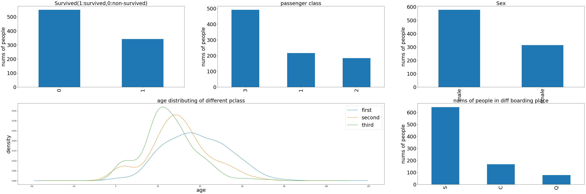
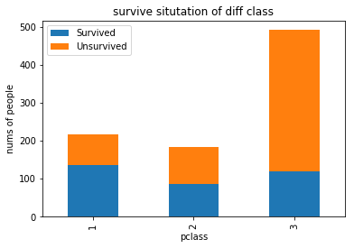
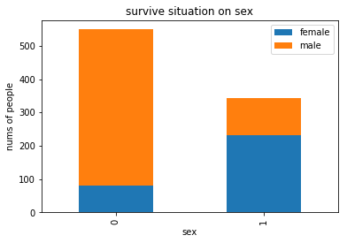
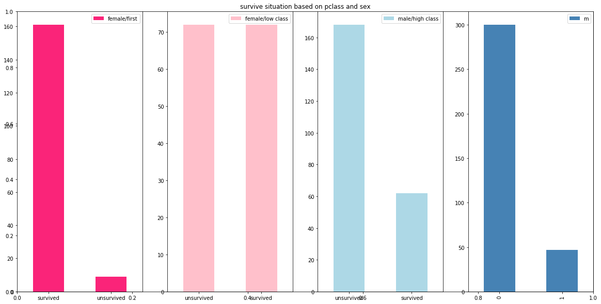
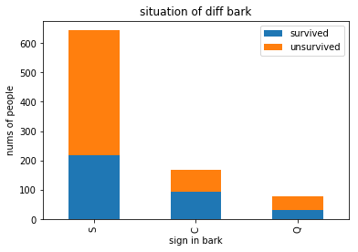
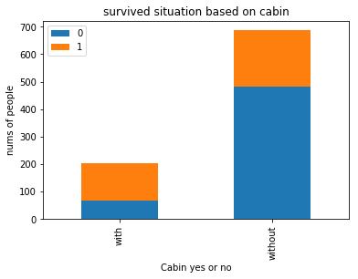
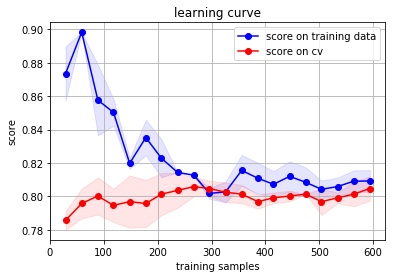

```python
import pandas as pd
import numpy as np
from pandas import Series,DataFrame

data_train = pd.read_csv('datasets/Train.csv')
print(data_train.head())
data_train.info()
data_train.describe()
```

       PassengerId  Survived  Pclass  \
    0            1         0       3   
    1            2         1       1   
    2            3         1       3   
    3            4         1       1   
    4            5         0       3   
    
                                                    Name     Sex   Age  SibSp  \
    0                            Braund, Mr. Owen Harris    male  22.0      1   
    1  Cumings, Mrs. John Bradley (Florence Briggs Th...  female  38.0      1   
    2                             Heikkinen, Miss. Laina  female  26.0      0   
    3       Futrelle, Mrs. Jacques Heath (Lily May Peel)  female  35.0      1   
    4                           Allen, Mr. William Henry    male  35.0      0   
    
       Parch            Ticket     Fare Cabin Embarked  
    0      0         A/5 21171   7.2500   NaN        S  
    1      0          PC 17599  71.2833   C85        C  
    2      0  STON/O2. 3101282   7.9250   NaN        S  
    3      0            113803  53.1000  C123        S  
    4      0            373450   8.0500   NaN        S  
    <class 'pandas.core.frame.DataFrame'>
    RangeIndex: 891 entries, 0 to 890
    Data columns (total 12 columns):
    PassengerId    891 non-null int64
    Survived       891 non-null int64
    Pclass         891 non-null int64
    Name           891 non-null object
    Sex            891 non-null object
    Age            714 non-null float64
    SibSp          891 non-null int64
    Parch          891 non-null int64
    Ticket         891 non-null object
    Fare           891 non-null float64
    Cabin          204 non-null object
    Embarked       889 non-null object
    dtypes: float64(2), int64(5), object(5)
    memory usage: 83.6+ KB
    


<div>
<style scoped>
    .dataframe tbody tr th:only-of-type {
        vertical-align: middle;
    }

    .dataframe tbody tr th {
        vertical-align: top;
    }

    .dataframe thead th {
        text-align: right;
    }
</style>
<table border="1" class="dataframe">
  <thead>
    <tr style="text-align: right;">
      <th></th>
      <th>PassengerId</th>
      <th>Survived</th>
      <th>Pclass</th>
      <th>Age</th>
      <th>SibSp</th>
      <th>Parch</th>
      <th>Fare</th>
    </tr>
  </thead>
  <tbody>
    <tr>
      <th>count</th>
      <td>891.000000</td>
      <td>891.000000</td>
      <td>891.000000</td>
      <td>714.000000</td>
      <td>891.000000</td>
      <td>891.000000</td>
      <td>891.000000</td>
    </tr>
    <tr>
      <th>mean</th>
      <td>446.000000</td>
      <td>0.383838</td>
      <td>2.308642</td>
      <td>29.699118</td>
      <td>0.523008</td>
      <td>0.381594</td>
      <td>32.204208</td>
    </tr>
    <tr>
      <th>std</th>
      <td>257.353842</td>
      <td>0.486592</td>
      <td>0.836071</td>
      <td>14.526497</td>
      <td>1.102743</td>
      <td>0.806057</td>
      <td>49.693429</td>
    </tr>
    <tr>
      <th>min</th>
      <td>1.000000</td>
      <td>0.000000</td>
      <td>1.000000</td>
      <td>0.420000</td>
      <td>0.000000</td>
      <td>0.000000</td>
      <td>0.000000</td>
    </tr>
    <tr>
      <th>25%</th>
      <td>223.500000</td>
      <td>0.000000</td>
      <td>2.000000</td>
      <td>20.125000</td>
      <td>0.000000</td>
      <td>0.000000</td>
      <td>7.910400</td>
    </tr>
    <tr>
      <th>50%</th>
      <td>446.000000</td>
      <td>0.000000</td>
      <td>3.000000</td>
      <td>28.000000</td>
      <td>0.000000</td>
      <td>0.000000</td>
      <td>14.454200</td>
    </tr>
    <tr>
      <th>75%</th>
      <td>668.500000</td>
      <td>1.000000</td>
      <td>3.000000</td>
      <td>38.000000</td>
      <td>1.000000</td>
      <td>0.000000</td>
      <td>31.000000</td>
    </tr>
    <tr>
      <th>max</th>
      <td>891.000000</td>
      <td>1.000000</td>
      <td>3.000000</td>
      <td>80.000000</td>
      <td>8.000000</td>
      <td>6.000000</td>
      <td>512.329200</td>
    </tr>
  </tbody>
</table>
</div>


```python
import matplotlib.pyplot as plt
fig = plt.figure(figsize=(60,30))
fig.set(alpha=0.2)

plt.subplot2grid((3,3),(0,0))#每一张大图理分裂几个小图
data_train.Survived.value_counts().plot(kind='bar',fontsize=30)
plt.title('Survived(1:survived,0:non-survived)',fontsize=30)
plt.ylabel('nums of people',fontsize=30)

plt.subplot2grid((3,3),(0,1))
data_train.Pclass.value_counts().plot(kind='bar',fontsize=30)
plt.title('passenger class',fontsize=30)
plt.ylabel('nums of people',fontsize=30)

plt.subplot2grid((3,3),(0,2))
data_train.Sex.value_counts().plot(kind='bar',fontsize=30)
plt.title('Sex',fontsize=30)
plt.ylabel('nums of people',fontsize=30)

plt.subplot2grid((3,3),(0,2))
data_train.Sex.value_counts().plot(kind='bar',fontsize=30)
plt.title('Sex',fontsize=30)
plt.ylabel('nums of people',fontsize=30)

plt.subplot2grid((3,3),(1,0),colspan=2)
data_train.Age[data_train.Pclass==1].plot(kind='kde')
data_train.Age[data_train.Pclass==2].plot(kind='kde')
data_train.Age[data_train.Pclass==3].plot(kind='kde')
plt.xlabel('age',fontsize=30)
plt.ylabel('density',fontsize=30)
plt.title('age distributing of different pclass',fontsize=30)
plt.legend(('first','second','third'),loc='best',fontsize=30)

plt.subplot2grid((3,3),(1,2))
data_train.Embarked.value_counts().plot(kind='bar',fontsize=30)
plt.title('nums of people in diff boarding place',fontsize=30)
plt.ylabel('nums of people',fontsize=30)

plt.show()
```





```python
fig = plt.figure()
fig.set(alpha=0.2)

Survived_0 = data_train.Pclass[data_train.Survived==0].value_counts()
Survived_1 = data_train.Pclass[data_train.Survived==1].value_counts()
df = pd.DataFrame({'Survived':Survived_1,'Unsurvived':Survived_0})
df.plot(kind='bar',stacked=True)
plt.title('survive situtation of diff class')
plt.xlabel('pclass')
plt.ylabel('nums of people')
plt.show()
```


    <Figure size 432x288 with 0 Axes>





```python
fig = plt.figure()
fig.set(alpha=0.2)

Survived_m = data_train.Survived[data_train.Sex=='male'].value_counts()
Survived_f = data_train.Survived[data_train.Sex=='female'].value_counts()
df = pd.DataFrame({'male':Survived_m,'female':Survived_f})
df.plot(kind='bar',stacked=True)
plt.title('survive situation on sex')
plt.xlabel('sex')
plt.ylabel('nums of people')
plt.show()
```


    <Figure size 432x288 with 0 Axes>





```python
fig = plt.figure(figsize=(20,10))
fig.set(alpha=0.5)
plt.title('survive situation based on pclass and sex')

ax1=fig.add_subplot(141)
data_train.Survived[data_train.Sex == 'female'][data_train.Pclass != 3].value_counts().plot(kind='bar', label="female highclass", color='#FA2479')
ax1.set_xticklabels(["survived", "unsurvived"], rotation=0)
ax1.legend([u"female/first"], loc='best')

ax2=fig.add_subplot(142)
data_train.Survived[data_train.Sex=='female'][data_train.Pclass==3].value_counts().plot(kind='bar',label='female low class',color='pink')
ax2.set_xticklabels(['unsurvived','survived'],rotation=0)
plt.legend(['female/low class'],loc='best')

ax3= fig.add_subplot(143)
data_train.Survived[data_train.Sex=='male'][data_train.Pclass!=3].value_counts().plot(kind='bar',label='male high class',color='lightblue')
ax3.set_xticklabels(['unsurvived','survived'],rotation=0)
plt.legend(['male/high class'],loc='best')

ax4 = fig.add_subplot(144)
data_train.Survived[data_train.Sex=='male'][data_train.Pclass==3].value_counts().plot(kind='bar',label='male low class',color='steelblue')
ax3.set_xticklabels(['unsurvived','survived'])
plt.legend('male/low class')
plt.show()
```





```python
fig = plt.figure()
fig.set(alpha=0.2)  # 设定图表颜色alpha参数

Survived_0 = data_train.Embarked[data_train.Survived == 0].value_counts()
Survived_1 = data_train.Embarked[data_train.Survived == 1].value_counts()
df=pd.DataFrame({'survived':Survived_1, 'unsurvived':Survived_0})
df.plot(kind='bar', stacked=True)
plt.title(u"situation of diff bark")
plt.xlabel(u"sign in bark") 
plt.ylabel(u"nums of people") 

plt.show()
```


    <Figure size 432x288 with 0 Axes>





```python
g = data_train.groupby(['SibSp','Survived'])
df = pd.DataFrame(g.count()['PassengerId'])
print(df)

# g = data_train.groupby(['SibSp','Survived'])
# df = pd.DataFrame(g.count()['PassengerId'])
# print(df)
```

                    PassengerId
    SibSp Survived             
    0     0                 398
          1                 210
    1     0                  97
          1                 112
    2     0                  15
          1                  13
    3     0                  12
          1                   4
    4     0                  15
          1                   3
    5     0                   5
    8     0                   7
    


```python
# cabin仅204个值，现查看其分布
data_train.Cabin.value_counts()
```


    G6                 4
    B96 B98            4
    C23 C25 C27        4
    C22 C26            3
    F33                3
    E101               3
    F2                 3
    D                  3
    C83                2
    C2                 2
    B58 B60            2
    B22                2
    C123               2
    B57 B59 B63 B66    2
    B35                2
    B18                2
    E67                2
    C65                2
    E33                2
    C125               2
    C93                2
    D17                2
    B20                2
    F4                 2
    E121               2
    D33                2
    E24                2
    B49                2
    C124               2
    E25                2
                      ..
    E34                1
    E50                1
    B42                1
    D56                1
    D37                1
    E12                1
    A6                 1
    E68                1
    A24                1
    B82 B84            1
    C110               1
    C7                 1
    D11                1
    C50                1
    D30                1
    C95                1
    C82                1
    D10 D12            1
    B3                 1
    E17                1
    F38                1
    F E69              1
    C30                1
    B37                1
    A20                1
    D15                1
    C111               1
    E77                1
    D50                1
    E46                1
    Name: Cabin, Length: 147, dtype: int64


```python
fig = plt.figure()
fig.set(alpha=0.2)  # 设定图表颜色alpha参数

Survived_cabin = data_train.Survived[pd.notnull(data_train.Cabin)].value_counts()
Survived_nocabin = data_train.Survived[pd.isnull(data_train.Cabin)].value_counts()
df=pd.DataFrame({'with':Survived_cabin, 'without':Survived_nocabin}).transpose()
df.plot(kind='bar', stacked=True)
plt.title(u"survived situation based on cabin")
plt.xlabel(u"Cabin yes or no") 
plt.ylabel(u"nums of people")
plt.show()
```


    <Figure size 432x288 with 0 Axes>





```python
# 特征工程：处理Cabin和Age
# Cabin缺失过多，根据上一个cell介绍，可将有无Cabin处理为yes或no两种类型
# Age缺失处理：
## 若缺失样本占比过高，则直接舍去，否则作为特征加入的话可能反而变成噪声
## 缺失样本数适中且为为连续特征属性，则吧NaN作为新特征加入到类别中
## 确实样本数始终且为连续值特征属性，考虑一个给定Step将其离散化，然后NaN作为一个type加入
## 缺失值较少，可以试着根据已有值拟合一下数据，补充
from sklearn.ensemble import RandomForestRegressor

def set_missing_ages(df):
    # 把已有数值型特征取出来丢进Random Forest Regressor
    age_df = df[['Age','Fare','Parch','SibSp','Pclass']]
    
    # 乘客分成已知年龄和未知年龄两部分
    known_age = age_df[age_df.Age.notnull()].as_matrix()
    unknown_age = age_df[age_df.Age.isnull()].as_matrix()
    
    # y即目标年龄
    y = known_age[:,0]
    
    # X即特征属性值
    X = known_age[:,1:]
    
    # fit到RandomForestRegressor中
    rfr = RandomForestRegressor(random_state=0,n_estimators=2000,n_jobs=-1)
    rfr.fit(X,y)
    
    predictedAges = rfr.predict(unknown_age[:,1:])
    df.loc[(df.Age.isnull()),'Age'] = predictedAges
    
    return df,rfr

def set_Cabin_type(df):
    df.loc[(df.Cabin.notnull()),'Cabin'] = 'yes'
    df.loc[(df.Cabin.isnull()),'Cabin'] = 'no'
    return df

data_train,rfr = set_missing_ages(data_train)
data_train = set_Cabin_type(data_train)

data_train.info()
```

    D:\Program Files\Anaconda3\lib\site-packages\ipykernel_launcher.py:15: FutureWarning: Method .as_matrix will be removed in a future version. Use .values instead.
      from ipykernel import kernelapp as app
    D:\Program Files\Anaconda3\lib\site-packages\ipykernel_launcher.py:16: FutureWarning: Method .as_matrix will be removed in a future version. Use .values instead.
      app.launch_new_instance()
    

    <class 'pandas.core.frame.DataFrame'>
    RangeIndex: 891 entries, 0 to 890
    Data columns (total 12 columns):
    PassengerId    891 non-null int64
    Survived       891 non-null int64
    Pclass         891 non-null int64
    Name           891 non-null object
    Sex            891 non-null object
    Age            891 non-null float64
    SibSp          891 non-null int64
    Parch          891 non-null int64
    Ticket         891 non-null object
    Fare           891 non-null float64
    Cabin          891 non-null object
    Embarked       889 non-null object
    dtypes: float64(2), int64(5), object(5)
    memory usage: 83.6+ KB
    


```python
# 特征因子化：one-hot表示，例如原本cabin有yes和no，改为cabin_yes和cabin_bo两个属性
# dummies:仿制品
dummies_Cabin = pd.get_dummies(data_train['Cabin'],prefix='Cabin')
dummies_Embarked = pd.get_dummies(data_train['Embarked'],prefix='Embarked')
dummies_Sex = pd.get_dummies(data_train['Sex'],prefix='Sex')
dummies_Pclass = pd.get_dummies(data_train['Pclass'],prefix='Pclass')
df = pd.concat([data_train,dummies_Cabin,dummies_Embarked,dummies_Sex,dummies_Pclass],axis=1)
df.drop(['Pclass','Name','Sex','Ticket','Cabin','Embarked'],axis=1,inplace=True)
print(df.head())

```

       PassengerId  Survived   Age  SibSp  Parch     Fare  Cabin_no  Cabin_yes  \
    0            1         0  22.0      1      0   7.2500         1          0   
    1            2         1  38.0      1      0  71.2833         0          1   
    2            3         1  26.0      0      0   7.9250         1          0   
    3            4         1  35.0      1      0  53.1000         0          1   
    4            5         0  35.0      0      0   8.0500         1          0   
    
       Embarked_C  Embarked_Q  Embarked_S  Sex_female  Sex_male  Pclass_1  \
    0           0           0           1           0         1         0   
    1           1           0           0           1         0         1   
    2           0           0           1           1         0         0   
    3           0           0           1           1         0         1   
    4           0           0           1           0         1         0   
    
       Pclass_2  Pclass_3  
    0         0         1  
    1         0         0  
    2         0         1  
    3         0         0  
    4         0         1  
    


```python
# scale:规范化
import sklearn.preprocessing as preprocessing
scaler = preprocessing.StandardScaler()
age_scale_param = scaler.fit(df['Age'])
df['Age_scaled'] = scaler.fit_transform(df['Age'],age_scale_param)
fare_scale_param = scaler.fit(df['Fare'])
df['Fare_scaled'] = scaler.fit_transform(df['Fare'],fare_scale_param)
print(df)
```

         PassengerId  Survived        Age  SibSp  Parch      Fare  Cabin_no  \
    0              1         0  22.000000      1      0 -0.502445         1   
    1              2         1  38.000000      1      0  0.786845         0   
    2              3         1  26.000000      0      0 -0.488854         1   
    3              4         1  35.000000      1      0  0.420730         0   
    4              5         0  35.000000      0      0 -0.486337         1   
    5              6         0  23.828953      0      0 -0.478116         1   
    6              7         0  54.000000      0      0  0.395814         0   
    7              8         0   2.000000      3      1 -0.224083         1   
    8              9         1  27.000000      0      2 -0.424256         1   
    9             10         1  14.000000      1      0 -0.042956         1   
    10            11         1   4.000000      1      1 -0.312172         0   
    11            12         1  58.000000      0      0 -0.113846         0   
    12            13         0  20.000000      0      0 -0.486337         1   
    13            14         0  39.000000      1      5 -0.018709         1   
    14            15         0  14.000000      0      0 -0.490280         1   
    15            16         1  55.000000      0      0 -0.326267         1   
    16            17         0   2.000000      4      1 -0.061999         1   
    17            18         1  32.066493      0      0 -0.386671         1   
    18            19         0  31.000000      1      0 -0.285997         1   
    19            20         1  29.518205      0      0 -0.502949         1   
    20            21         0  35.000000      0      0 -0.124920         1   
    21            22         1  34.000000      0      0 -0.386671         0   
    22            23         1  15.000000      0      0 -0.486756         1   
    23            24         1  28.000000      0      0  0.066360         0   
    24            25         0   8.000000      3      1 -0.224083         1   
    25            26         1  38.000000      1      5 -0.016444         1   
    26            27         0  29.518205      0      0 -0.502949         1   
    27            28         0  19.000000      3      2  4.647001         0   
    28            29         1  22.380113      0      0 -0.489776         1   
    29            30         0  27.947206      0      0 -0.489442         1   
    ..           ...       ...        ...    ...    ...       ...       ...   
    861          862         0  21.000000      1      0 -0.416873         1   
    862          863         1  48.000000      0      0 -0.126345         0   
    863          864         0  10.869867      8      2  0.751946         1   
    864          865         0  24.000000      0      0 -0.386671         1   
    865          866         1  42.000000      0      0 -0.386671         1   
    866          867         1  27.000000      1      0 -0.369389         1   
    867          868         0  31.000000      0      0  0.368295         0   
    868          869         0  25.977889      0      0 -0.457142         1   
    869          870         1   4.000000      1      1 -0.424256         1   
    870          871         0  26.000000      0      0 -0.489442         1   
    871          872         1  47.000000      1      1  0.409741         0   
    872          873         0  33.000000      0      0 -0.547748         0   
    873          874         0  47.000000      0      0 -0.467209         1   
    874          875         1  28.000000      1      0 -0.165189         1   
    875          876         1  15.000000      0      0 -0.502949         1   
    876          877         0  20.000000      0      0 -0.450180         1   
    877          878         0  19.000000      0      0 -0.489442         1   
    878          879         0  27.947206      0      0 -0.489442         1   
    879          880         1  56.000000      0      1  1.025945         0   
    880          881         1  25.000000      0      1 -0.124920         1   
    881          882         0  33.000000      0      0 -0.489442         1   
    882          883         0  22.000000      0      0 -0.436671         1   
    883          884         0  28.000000      0      0 -0.437007         1   
    884          885         0  25.000000      0      0 -0.506472         1   
    885          886         0  39.000000      0      5 -0.061999         1   
    886          887         0  27.000000      0      0 -0.386671         1   
    887          888         1  19.000000      0      0 -0.044381         0   
    888          889         0  16.127950      1      2 -0.176263         1   
    889          890         1  26.000000      0      0 -0.044381         0   
    890          891         0  32.000000      0      0 -0.492378         1   
    
         Cabin_yes  Embarked_C  Embarked_Q  Embarked_S  Sex_female  Sex_male  \
    0            0           0           0           1           0         1   
    1            1           1           0           0           1         0   
    2            0           0           0           1           1         0   
    3            1           0           0           1           1         0   
    4            0           0           0           1           0         1   
    5            0           0           1           0           0         1   
    6            1           0           0           1           0         1   
    7            0           0           0           1           0         1   
    8            0           0           0           1           1         0   
    9            0           1           0           0           1         0   
    10           1           0           0           1           1         0   
    11           1           0           0           1           1         0   
    12           0           0           0           1           0         1   
    13           0           0           0           1           0         1   
    14           0           0           0           1           1         0   
    15           0           0           0           1           1         0   
    16           0           0           1           0           0         1   
    17           0           0           0           1           0         1   
    18           0           0           0           1           1         0   
    19           0           1           0           0           1         0   
    20           0           0           0           1           0         1   
    21           1           0           0           1           0         1   
    22           0           0           1           0           1         0   
    23           1           0           0           1           0         1   
    24           0           0           0           1           1         0   
    25           0           0           0           1           1         0   
    26           0           1           0           0           0         1   
    27           1           0           0           1           0         1   
    28           0           0           1           0           1         0   
    29           0           0           0           1           0         1   
    ..         ...         ...         ...         ...         ...       ...   
    861          0           0           0           1           0         1   
    862          1           0           0           1           1         0   
    863          0           0           0           1           1         0   
    864          0           0           0           1           0         1   
    865          0           0           0           1           1         0   
    866          0           1           0           0           1         0   
    867          1           0           0           1           0         1   
    868          0           0           0           1           0         1   
    869          0           0           0           1           0         1   
    870          0           0           0           1           0         1   
    871          1           0           0           1           1         0   
    872          1           0           0           1           0         1   
    873          0           0           0           1           0         1   
    874          0           1           0           0           1         0   
    875          0           1           0           0           1         0   
    876          0           0           0           1           0         1   
    877          0           0           0           1           0         1   
    878          0           0           0           1           0         1   
    879          1           1           0           0           1         0   
    880          0           0           0           1           1         0   
    881          0           0           0           1           0         1   
    882          0           0           0           1           1         0   
    883          0           0           0           1           0         1   
    884          0           0           0           1           0         1   
    885          0           0           1           0           1         0   
    886          0           0           0           1           0         1   
    887          1           0           0           1           1         0   
    888          0           0           0           1           1         0   
    889          1           1           0           0           0         1   
    890          0           0           1           0           0         1   
    
         Pclass_1  Pclass_2  Pclass_3  Age_scaled  Fare_scaled  
    0           0         0         1   -0.561363    -0.502445  
    1           1         0         0    0.613182     0.786845  
    2           0         0         1   -0.267727    -0.488854  
    3           1         0         0    0.392955     0.420730  
    4           0         0         1    0.392955    -0.486337  
    5           0         0         1   -0.427102    -0.478116  
    6           1         0         0    1.787727     0.395814  
    7           0         0         1   -2.029545    -0.224083  
    8           0         0         1   -0.194318    -0.424256  
    9           0         1         0   -1.148636    -0.042956  
    10          0         0         1   -1.882726    -0.312172  
    11          1         0         0    2.081363    -0.113846  
    12          0         0         1   -0.708181    -0.486337  
    13          0         0         1    0.686591    -0.018709  
    14          0         0         1   -1.148636    -0.490280  
    15          0         1         0    1.861136    -0.326267  
    16          0         0         1   -2.029545    -0.061999  
    17          0         1         0    0.177609    -0.386671  
    18          0         0         1    0.099318    -0.285997  
    19          0         0         1   -0.009459    -0.502949  
    20          0         1         0    0.392955    -0.124920  
    21          0         1         0    0.319546    -0.386671  
    22          0         0         1   -1.075227    -0.486756  
    23          1         0         0   -0.120909     0.066360  
    24          0         0         1   -1.589090    -0.224083  
    25          0         0         1    0.613182    -0.016444  
    26          0         0         1   -0.009459    -0.502949  
    27          1         0         0   -0.781590     4.647001  
    28          0         0         1   -0.533459    -0.489776  
    29          0         0         1   -0.124784    -0.489442  
    ..        ...       ...       ...         ...          ...  
    861         0         1         0   -0.634772    -0.416873  
    862         1         0         0    1.347272    -0.126345  
    863         0         0         1   -1.378416     0.751946  
    864         0         1         0   -0.414545    -0.386671  
    865         0         1         0    0.906818    -0.386671  
    866         0         1         0   -0.194318    -0.369389  
    867         1         0         0    0.099318     0.368295  
    868         0         0         1   -0.269350    -0.457142  
    869         0         0         1   -1.882726    -0.424256  
    870         0         0         1   -0.267727    -0.489442  
    871         1         0         0    1.273863     0.409741  
    872         1         0         0    0.246136    -0.547748  
    873         0         0         1    1.273863    -0.467209  
    874         0         1         0   -0.120909    -0.165189  
    875         0         0         1   -1.075227    -0.502949  
    876         0         0         1   -0.708181    -0.450180  
    877         0         0         1   -0.781590    -0.489442  
    878         0         0         1   -0.124784    -0.489442  
    879         1         0         0    1.934545     1.025945  
    880         0         1         0   -0.341136    -0.124920  
    881         0         0         1    0.246136    -0.489442  
    882         0         0         1   -0.561363    -0.436671  
    883         0         1         0   -0.120909    -0.437007  
    884         0         0         1   -0.341136    -0.506472  
    885         0         0         1    0.686591    -0.061999  
    886         0         1         0   -0.194318    -0.386671  
    887         1         0         0   -0.781590    -0.044381  
    888         0         0         1   -0.992425    -0.176263  
    889         1         0         0   -0.267727    -0.044381  
    890         0         0         1    0.172727    -0.492378  
    
    [891 rows x 18 columns]
    

    D:\Program Files\Anaconda3\lib\site-packages\sklearn\preprocessing\data.py:586: DeprecationWarning: Passing 1d arrays as data is deprecated in 0.17 and will raise ValueError in 0.19. Reshape your data either using X.reshape(-1, 1) if your data has a single feature or X.reshape(1, -1) if it contains a single sample.
      warnings.warn(DEPRECATION_MSG_1D, DeprecationWarning)
    D:\Program Files\Anaconda3\lib\site-packages\sklearn\preprocessing\data.py:586: DeprecationWarning: Passing 1d arrays as data is deprecated in 0.17 and will raise ValueError in 0.19. Reshape your data either using X.reshape(-1, 1) if your data has a single feature or X.reshape(1, -1) if it contains a single sample.
      warnings.warn(DEPRECATION_MSG_1D, DeprecationWarning)
    D:\Program Files\Anaconda3\lib\site-packages\sklearn\preprocessing\data.py:649: DeprecationWarning: Passing 1d arrays as data is deprecated in 0.17 and will raise ValueError in 0.19. Reshape your data either using X.reshape(-1, 1) if your data has a single feature or X.reshape(1, -1) if it contains a single sample.
      warnings.warn(DEPRECATION_MSG_1D, DeprecationWarning)
    D:\Program Files\Anaconda3\lib\site-packages\sklearn\preprocessing\data.py:586: DeprecationWarning: Passing 1d arrays as data is deprecated in 0.17 and will raise ValueError in 0.19. Reshape your data either using X.reshape(-1, 1) if your data has a single feature or X.reshape(1, -1) if it contains a single sample.
      warnings.warn(DEPRECATION_MSG_1D, DeprecationWarning)
    D:\Program Files\Anaconda3\lib\site-packages\sklearn\preprocessing\data.py:586: DeprecationWarning: Passing 1d arrays as data is deprecated in 0.17 and will raise ValueError in 0.19. Reshape your data either using X.reshape(-1, 1) if your data has a single feature or X.reshape(1, -1) if it contains a single sample.
      warnings.warn(DEPRECATION_MSG_1D, DeprecationWarning)
    D:\Program Files\Anaconda3\lib\site-packages\sklearn\preprocessing\data.py:649: DeprecationWarning: Passing 1d arrays as data is deprecated in 0.17 and will raise ValueError in 0.19. Reshape your data either using X.reshape(-1, 1) if your data has a single feature or X.reshape(1, -1) if it contains a single sample.
      warnings.warn(DEPRECATION_MSG_1D, DeprecationWarning)
    


```python
# 逻辑回归建模
from sklearn import linear_model

# 用正则去除我们需要的属性值
train_df = df.filter(regex='Survived|Age_.*|SibSp|Parch|Fare_.*|Cabin_.*|Embarked_.*|Sex_.*|Pclass_.*')
train_np = train_df.as_matrix()

# y即survival结果
y = train_np[:,0]

# X 即特征属性值
X = train_np[:,1:]

#fit到RandomForestRegressor中
clf = linear_model.LogisticRegression(solver='liblinear',C=1.0,penalty='l1',tol=1e-6)
clf.fit(X,y)

clf
```

    D:\Program Files\Anaconda3\lib\site-packages\ipykernel_launcher.py:6: FutureWarning: Method .as_matrix will be removed in a future version. Use .values instead.
      
    


    LogisticRegression(C=1.0, class_weight=None, dual=False, fit_intercept=True,
              intercept_scaling=1, max_iter=100, multi_class='ovr', n_jobs=1,
              penalty='l1', random_state=None, solver='liblinear', tol=1e-06,
              verbose=0, warm_start=False)


```python
# 对测试集作同样的预处理
data_test = pd.read_csv('datasets/test.csv')
data_test.loc[(data_test.Fare.isnull()),'Fare'] = 0
# 对test_data做和train_data一致的特征变换
tmp_df = data_test[['Age','Fare','Parch','SibSp','Pclass']]
null_age = tmp_df[data_test.Age.isnull()].as_matrix()
X = null_age[:,1:]
predictedAges = rfr.predict(X)
data_test.loc[(data_test.Age.isnull()),'Age']=predictedAges

data_test = set_Cabin_type(data_test)
dummies_Cabin = pd.get_dummies(data_test['Cabin'], prefix= 'Cabin')
dummies_Embarked = pd.get_dummies(data_test['Embarked'], prefix= 'Embarked')
dummies_Sex = pd.get_dummies(data_test['Sex'], prefix= 'Sex')
dummies_Pclass = pd.get_dummies(data_test['Pclass'], prefix= 'Pclass')

df_test = pd.concat([data_test, dummies_Cabin, dummies_Embarked, dummies_Sex, dummies_Pclass], axis=1)
df_test.drop(['Pclass', 'Name', 'Sex', 'Ticket', 'Cabin', 'Embarked'], axis=1, inplace=True)
df_test['Age_scaled'] = scaler.fit_transform(df_test['Age'], age_scale_param)
df_test['Fare_scaled'] = scaler.fit_transform(df_test['Fare'], fare_scale_param)
df_test
```

    D:\Program Files\Anaconda3\lib\site-packages\ipykernel_launcher.py:6: FutureWarning: Method .as_matrix will be removed in a future version. Use .values instead.
      
    D:\Program Files\Anaconda3\lib\site-packages\sklearn\preprocessing\data.py:586: DeprecationWarning: Passing 1d arrays as data is deprecated in 0.17 and will raise ValueError in 0.19. Reshape your data either using X.reshape(-1, 1) if your data has a single feature or X.reshape(1, -1) if it contains a single sample.
      warnings.warn(DEPRECATION_MSG_1D, DeprecationWarning)
    D:\Program Files\Anaconda3\lib\site-packages\sklearn\preprocessing\data.py:649: DeprecationWarning: Passing 1d arrays as data is deprecated in 0.17 and will raise ValueError in 0.19. Reshape your data either using X.reshape(-1, 1) if your data has a single feature or X.reshape(1, -1) if it contains a single sample.
      warnings.warn(DEPRECATION_MSG_1D, DeprecationWarning)
    D:\Program Files\Anaconda3\lib\site-packages\sklearn\preprocessing\data.py:586: DeprecationWarning: Passing 1d arrays as data is deprecated in 0.17 and will raise ValueError in 0.19. Reshape your data either using X.reshape(-1, 1) if your data has a single feature or X.reshape(1, -1) if it contains a single sample.
      warnings.warn(DEPRECATION_MSG_1D, DeprecationWarning)
    D:\Program Files\Anaconda3\lib\site-packages\sklearn\preprocessing\data.py:649: DeprecationWarning: Passing 1d arrays as data is deprecated in 0.17 and will raise ValueError in 0.19. Reshape your data either using X.reshape(-1, 1) if your data has a single feature or X.reshape(1, -1) if it contains a single sample.
      warnings.warn(DEPRECATION_MSG_1D, DeprecationWarning)
    


<div>
<style scoped>
    .dataframe tbody tr th:only-of-type {
        vertical-align: middle;
    }

    .dataframe tbody tr th {
        vertical-align: top;
    }

    .dataframe thead th {
        text-align: right;
    }
</style>
<table border="1" class="dataframe">
  <thead>
    <tr style="text-align: right;">
      <th></th>
      <th>PassengerId</th>
      <th>Age</th>
      <th>SibSp</th>
      <th>Parch</th>
      <th>Fare</th>
      <th>Cabin_no</th>
      <th>Cabin_yes</th>
      <th>Embarked_C</th>
      <th>Embarked_Q</th>
      <th>Embarked_S</th>
      <th>Sex_female</th>
      <th>Sex_male</th>
      <th>Pclass_1</th>
      <th>Pclass_2</th>
      <th>Pclass_3</th>
      <th>Age_scaled</th>
      <th>Fare_scaled</th>
    </tr>
  </thead>
  <tbody>
    <tr>
      <th>0</th>
      <td>892</td>
      <td>34.500000</td>
      <td>0</td>
      <td>0</td>
      <td>7.8292</td>
      <td>1</td>
      <td>0</td>
      <td>0</td>
      <td>1</td>
      <td>0</td>
      <td>0</td>
      <td>1</td>
      <td>0</td>
      <td>0</td>
      <td>1</td>
      <td>0.307535</td>
      <td>-0.496637</td>
    </tr>
    <tr>
      <th>1</th>
      <td>893</td>
      <td>47.000000</td>
      <td>1</td>
      <td>0</td>
      <td>7.0000</td>
      <td>1</td>
      <td>0</td>
      <td>0</td>
      <td>0</td>
      <td>1</td>
      <td>1</td>
      <td>0</td>
      <td>0</td>
      <td>0</td>
      <td>1</td>
      <td>1.256230</td>
      <td>-0.511497</td>
    </tr>
    <tr>
      <th>2</th>
      <td>894</td>
      <td>62.000000</td>
      <td>0</td>
      <td>0</td>
      <td>9.6875</td>
      <td>1</td>
      <td>0</td>
      <td>0</td>
      <td>1</td>
      <td>0</td>
      <td>0</td>
      <td>1</td>
      <td>0</td>
      <td>1</td>
      <td>0</td>
      <td>2.394665</td>
      <td>-0.463335</td>
    </tr>
    <tr>
      <th>3</th>
      <td>895</td>
      <td>27.000000</td>
      <td>0</td>
      <td>0</td>
      <td>8.6625</td>
      <td>1</td>
      <td>0</td>
      <td>0</td>
      <td>0</td>
      <td>1</td>
      <td>0</td>
      <td>1</td>
      <td>0</td>
      <td>0</td>
      <td>1</td>
      <td>-0.261683</td>
      <td>-0.481704</td>
    </tr>
    <tr>
      <th>4</th>
      <td>896</td>
      <td>22.000000</td>
      <td>1</td>
      <td>1</td>
      <td>12.2875</td>
      <td>1</td>
      <td>0</td>
      <td>0</td>
      <td>0</td>
      <td>1</td>
      <td>1</td>
      <td>0</td>
      <td>0</td>
      <td>0</td>
      <td>1</td>
      <td>-0.641161</td>
      <td>-0.416740</td>
    </tr>
    <tr>
      <th>5</th>
      <td>897</td>
      <td>14.000000</td>
      <td>0</td>
      <td>0</td>
      <td>9.2250</td>
      <td>1</td>
      <td>0</td>
      <td>0</td>
      <td>0</td>
      <td>1</td>
      <td>0</td>
      <td>1</td>
      <td>0</td>
      <td>0</td>
      <td>1</td>
      <td>-1.248326</td>
      <td>-0.471623</td>
    </tr>
    <tr>
      <th>6</th>
      <td>898</td>
      <td>30.000000</td>
      <td>0</td>
      <td>0</td>
      <td>7.6292</td>
      <td>1</td>
      <td>0</td>
      <td>0</td>
      <td>1</td>
      <td>0</td>
      <td>1</td>
      <td>0</td>
      <td>0</td>
      <td>0</td>
      <td>1</td>
      <td>-0.033996</td>
      <td>-0.500221</td>
    </tr>
    <tr>
      <th>7</th>
      <td>899</td>
      <td>26.000000</td>
      <td>1</td>
      <td>1</td>
      <td>29.0000</td>
      <td>1</td>
      <td>0</td>
      <td>0</td>
      <td>0</td>
      <td>1</td>
      <td>0</td>
      <td>1</td>
      <td>0</td>
      <td>1</td>
      <td>0</td>
      <td>-0.337578</td>
      <td>-0.117238</td>
    </tr>
    <tr>
      <th>8</th>
      <td>900</td>
      <td>18.000000</td>
      <td>0</td>
      <td>0</td>
      <td>7.2292</td>
      <td>1</td>
      <td>0</td>
      <td>1</td>
      <td>0</td>
      <td>0</td>
      <td>1</td>
      <td>0</td>
      <td>0</td>
      <td>0</td>
      <td>1</td>
      <td>-0.944743</td>
      <td>-0.507390</td>
    </tr>
    <tr>
      <th>9</th>
      <td>901</td>
      <td>21.000000</td>
      <td>2</td>
      <td>0</td>
      <td>24.1500</td>
      <td>1</td>
      <td>0</td>
      <td>0</td>
      <td>0</td>
      <td>1</td>
      <td>0</td>
      <td>1</td>
      <td>0</td>
      <td>0</td>
      <td>1</td>
      <td>-0.717056</td>
      <td>-0.204154</td>
    </tr>
    <tr>
      <th>10</th>
      <td>902</td>
      <td>27.947206</td>
      <td>0</td>
      <td>0</td>
      <td>7.8958</td>
      <td>1</td>
      <td>0</td>
      <td>0</td>
      <td>0</td>
      <td>1</td>
      <td>0</td>
      <td>1</td>
      <td>0</td>
      <td>0</td>
      <td>1</td>
      <td>-0.189794</td>
      <td>-0.495444</td>
    </tr>
    <tr>
      <th>11</th>
      <td>903</td>
      <td>46.000000</td>
      <td>0</td>
      <td>0</td>
      <td>26.0000</td>
      <td>1</td>
      <td>0</td>
      <td>0</td>
      <td>0</td>
      <td>1</td>
      <td>0</td>
      <td>1</td>
      <td>1</td>
      <td>0</td>
      <td>0</td>
      <td>1.180334</td>
      <td>-0.171000</td>
    </tr>
    <tr>
      <th>12</th>
      <td>904</td>
      <td>23.000000</td>
      <td>1</td>
      <td>0</td>
      <td>82.2667</td>
      <td>0</td>
      <td>1</td>
      <td>0</td>
      <td>0</td>
      <td>1</td>
      <td>1</td>
      <td>0</td>
      <td>1</td>
      <td>0</td>
      <td>0</td>
      <td>-0.565265</td>
      <td>0.837349</td>
    </tr>
    <tr>
      <th>13</th>
      <td>905</td>
      <td>63.000000</td>
      <td>1</td>
      <td>0</td>
      <td>26.0000</td>
      <td>1</td>
      <td>0</td>
      <td>0</td>
      <td>0</td>
      <td>1</td>
      <td>0</td>
      <td>1</td>
      <td>0</td>
      <td>1</td>
      <td>0</td>
      <td>2.470560</td>
      <td>-0.171000</td>
    </tr>
    <tr>
      <th>14</th>
      <td>906</td>
      <td>47.000000</td>
      <td>1</td>
      <td>0</td>
      <td>61.1750</td>
      <td>0</td>
      <td>1</td>
      <td>0</td>
      <td>0</td>
      <td>1</td>
      <td>1</td>
      <td>0</td>
      <td>1</td>
      <td>0</td>
      <td>0</td>
      <td>1.256230</td>
      <td>0.459367</td>
    </tr>
    <tr>
      <th>15</th>
      <td>907</td>
      <td>24.000000</td>
      <td>1</td>
      <td>0</td>
      <td>27.7208</td>
      <td>1</td>
      <td>0</td>
      <td>1</td>
      <td>0</td>
      <td>0</td>
      <td>1</td>
      <td>0</td>
      <td>0</td>
      <td>1</td>
      <td>0</td>
      <td>-0.489370</td>
      <td>-0.140162</td>
    </tr>
    <tr>
      <th>16</th>
      <td>908</td>
      <td>35.000000</td>
      <td>0</td>
      <td>0</td>
      <td>12.3500</td>
      <td>1</td>
      <td>0</td>
      <td>0</td>
      <td>1</td>
      <td>0</td>
      <td>0</td>
      <td>1</td>
      <td>0</td>
      <td>1</td>
      <td>0</td>
      <td>0.345482</td>
      <td>-0.415620</td>
    </tr>
    <tr>
      <th>17</th>
      <td>909</td>
      <td>21.000000</td>
      <td>0</td>
      <td>0</td>
      <td>7.2250</td>
      <td>1</td>
      <td>0</td>
      <td>1</td>
      <td>0</td>
      <td>0</td>
      <td>0</td>
      <td>1</td>
      <td>0</td>
      <td>0</td>
      <td>1</td>
      <td>-0.717056</td>
      <td>-0.507465</td>
    </tr>
    <tr>
      <th>18</th>
      <td>910</td>
      <td>27.000000</td>
      <td>1</td>
      <td>0</td>
      <td>7.9250</td>
      <td>1</td>
      <td>0</td>
      <td>0</td>
      <td>0</td>
      <td>1</td>
      <td>1</td>
      <td>0</td>
      <td>0</td>
      <td>0</td>
      <td>1</td>
      <td>-0.261683</td>
      <td>-0.494920</td>
    </tr>
    <tr>
      <th>19</th>
      <td>911</td>
      <td>45.000000</td>
      <td>0</td>
      <td>0</td>
      <td>7.2250</td>
      <td>1</td>
      <td>0</td>
      <td>1</td>
      <td>0</td>
      <td>0</td>
      <td>1</td>
      <td>0</td>
      <td>0</td>
      <td>0</td>
      <td>1</td>
      <td>1.104439</td>
      <td>-0.507465</td>
    </tr>
    <tr>
      <th>20</th>
      <td>912</td>
      <td>55.000000</td>
      <td>1</td>
      <td>0</td>
      <td>59.4000</td>
      <td>1</td>
      <td>0</td>
      <td>1</td>
      <td>0</td>
      <td>0</td>
      <td>0</td>
      <td>1</td>
      <td>1</td>
      <td>0</td>
      <td>0</td>
      <td>1.863395</td>
      <td>0.427557</td>
    </tr>
    <tr>
      <th>21</th>
      <td>913</td>
      <td>9.000000</td>
      <td>0</td>
      <td>1</td>
      <td>3.1708</td>
      <td>1</td>
      <td>0</td>
      <td>0</td>
      <td>0</td>
      <td>1</td>
      <td>0</td>
      <td>1</td>
      <td>0</td>
      <td>0</td>
      <td>1</td>
      <td>-1.627804</td>
      <td>-0.580120</td>
    </tr>
    <tr>
      <th>22</th>
      <td>914</td>
      <td>52.314311</td>
      <td>0</td>
      <td>0</td>
      <td>31.6833</td>
      <td>1</td>
      <td>0</td>
      <td>0</td>
      <td>0</td>
      <td>1</td>
      <td>1</td>
      <td>0</td>
      <td>1</td>
      <td>0</td>
      <td>0</td>
      <td>1.659563</td>
      <td>-0.069151</td>
    </tr>
    <tr>
      <th>23</th>
      <td>915</td>
      <td>21.000000</td>
      <td>0</td>
      <td>1</td>
      <td>61.3792</td>
      <td>1</td>
      <td>0</td>
      <td>1</td>
      <td>0</td>
      <td>0</td>
      <td>0</td>
      <td>1</td>
      <td>1</td>
      <td>0</td>
      <td>0</td>
      <td>-0.717056</td>
      <td>0.463026</td>
    </tr>
    <tr>
      <th>24</th>
      <td>916</td>
      <td>48.000000</td>
      <td>1</td>
      <td>3</td>
      <td>262.3750</td>
      <td>0</td>
      <td>1</td>
      <td>1</td>
      <td>0</td>
      <td>0</td>
      <td>1</td>
      <td>0</td>
      <td>1</td>
      <td>0</td>
      <td>0</td>
      <td>1.332126</td>
      <td>4.065049</td>
    </tr>
    <tr>
      <th>25</th>
      <td>917</td>
      <td>50.000000</td>
      <td>1</td>
      <td>0</td>
      <td>14.5000</td>
      <td>1</td>
      <td>0</td>
      <td>0</td>
      <td>0</td>
      <td>1</td>
      <td>0</td>
      <td>1</td>
      <td>0</td>
      <td>0</td>
      <td>1</td>
      <td>1.483917</td>
      <td>-0.377090</td>
    </tr>
    <tr>
      <th>26</th>
      <td>918</td>
      <td>22.000000</td>
      <td>0</td>
      <td>1</td>
      <td>61.9792</td>
      <td>0</td>
      <td>1</td>
      <td>1</td>
      <td>0</td>
      <td>0</td>
      <td>1</td>
      <td>0</td>
      <td>1</td>
      <td>0</td>
      <td>0</td>
      <td>-0.641161</td>
      <td>0.473779</td>
    </tr>
    <tr>
      <th>27</th>
      <td>919</td>
      <td>22.500000</td>
      <td>0</td>
      <td>0</td>
      <td>7.2250</td>
      <td>1</td>
      <td>0</td>
      <td>1</td>
      <td>0</td>
      <td>0</td>
      <td>0</td>
      <td>1</td>
      <td>0</td>
      <td>0</td>
      <td>1</td>
      <td>-0.603213</td>
      <td>-0.507465</td>
    </tr>
    <tr>
      <th>28</th>
      <td>920</td>
      <td>41.000000</td>
      <td>0</td>
      <td>0</td>
      <td>30.5000</td>
      <td>0</td>
      <td>1</td>
      <td>0</td>
      <td>0</td>
      <td>1</td>
      <td>0</td>
      <td>1</td>
      <td>1</td>
      <td>0</td>
      <td>0</td>
      <td>0.800856</td>
      <td>-0.090356</td>
    </tr>
    <tr>
      <th>29</th>
      <td>921</td>
      <td>23.458621</td>
      <td>2</td>
      <td>0</td>
      <td>21.6792</td>
      <td>1</td>
      <td>0</td>
      <td>1</td>
      <td>0</td>
      <td>0</td>
      <td>0</td>
      <td>1</td>
      <td>0</td>
      <td>0</td>
      <td>1</td>
      <td>-0.530458</td>
      <td>-0.248433</td>
    </tr>
    <tr>
      <th>...</th>
      <td>...</td>
      <td>...</td>
      <td>...</td>
      <td>...</td>
      <td>...</td>
      <td>...</td>
      <td>...</td>
      <td>...</td>
      <td>...</td>
      <td>...</td>
      <td>...</td>
      <td>...</td>
      <td>...</td>
      <td>...</td>
      <td>...</td>
      <td>...</td>
      <td>...</td>
    </tr>
    <tr>
      <th>388</th>
      <td>1280</td>
      <td>21.000000</td>
      <td>0</td>
      <td>0</td>
      <td>7.7500</td>
      <td>1</td>
      <td>0</td>
      <td>0</td>
      <td>1</td>
      <td>0</td>
      <td>0</td>
      <td>1</td>
      <td>0</td>
      <td>0</td>
      <td>1</td>
      <td>-0.717056</td>
      <td>-0.498056</td>
    </tr>
    <tr>
      <th>389</th>
      <td>1281</td>
      <td>6.000000</td>
      <td>3</td>
      <td>1</td>
      <td>21.0750</td>
      <td>1</td>
      <td>0</td>
      <td>0</td>
      <td>0</td>
      <td>1</td>
      <td>0</td>
      <td>1</td>
      <td>0</td>
      <td>0</td>
      <td>1</td>
      <td>-1.855491</td>
      <td>-0.259261</td>
    </tr>
    <tr>
      <th>390</th>
      <td>1282</td>
      <td>23.000000</td>
      <td>0</td>
      <td>0</td>
      <td>93.5000</td>
      <td>0</td>
      <td>1</td>
      <td>0</td>
      <td>0</td>
      <td>1</td>
      <td>0</td>
      <td>1</td>
      <td>1</td>
      <td>0</td>
      <td>0</td>
      <td>-0.565265</td>
      <td>1.038659</td>
    </tr>
    <tr>
      <th>391</th>
      <td>1283</td>
      <td>51.000000</td>
      <td>0</td>
      <td>1</td>
      <td>39.4000</td>
      <td>0</td>
      <td>1</td>
      <td>0</td>
      <td>0</td>
      <td>1</td>
      <td>1</td>
      <td>0</td>
      <td>1</td>
      <td>0</td>
      <td>0</td>
      <td>1.559813</td>
      <td>0.069140</td>
    </tr>
    <tr>
      <th>392</th>
      <td>1284</td>
      <td>13.000000</td>
      <td>0</td>
      <td>2</td>
      <td>20.2500</td>
      <td>1</td>
      <td>0</td>
      <td>0</td>
      <td>0</td>
      <td>1</td>
      <td>0</td>
      <td>1</td>
      <td>0</td>
      <td>0</td>
      <td>1</td>
      <td>-1.324222</td>
      <td>-0.274045</td>
    </tr>
    <tr>
      <th>393</th>
      <td>1285</td>
      <td>47.000000</td>
      <td>0</td>
      <td>0</td>
      <td>10.5000</td>
      <td>1</td>
      <td>0</td>
      <td>0</td>
      <td>0</td>
      <td>1</td>
      <td>0</td>
      <td>1</td>
      <td>0</td>
      <td>1</td>
      <td>0</td>
      <td>1.256230</td>
      <td>-0.448774</td>
    </tr>
    <tr>
      <th>394</th>
      <td>1286</td>
      <td>29.000000</td>
      <td>3</td>
      <td>1</td>
      <td>22.0250</td>
      <td>1</td>
      <td>0</td>
      <td>0</td>
      <td>0</td>
      <td>1</td>
      <td>0</td>
      <td>1</td>
      <td>0</td>
      <td>0</td>
      <td>1</td>
      <td>-0.109891</td>
      <td>-0.242236</td>
    </tr>
    <tr>
      <th>395</th>
      <td>1287</td>
      <td>18.000000</td>
      <td>1</td>
      <td>0</td>
      <td>60.0000</td>
      <td>0</td>
      <td>1</td>
      <td>0</td>
      <td>0</td>
      <td>1</td>
      <td>1</td>
      <td>0</td>
      <td>1</td>
      <td>0</td>
      <td>0</td>
      <td>-0.944743</td>
      <td>0.438310</td>
    </tr>
    <tr>
      <th>396</th>
      <td>1288</td>
      <td>24.000000</td>
      <td>0</td>
      <td>0</td>
      <td>7.2500</td>
      <td>1</td>
      <td>0</td>
      <td>0</td>
      <td>1</td>
      <td>0</td>
      <td>0</td>
      <td>1</td>
      <td>0</td>
      <td>0</td>
      <td>1</td>
      <td>-0.489370</td>
      <td>-0.507017</td>
    </tr>
    <tr>
      <th>397</th>
      <td>1289</td>
      <td>48.000000</td>
      <td>1</td>
      <td>1</td>
      <td>79.2000</td>
      <td>0</td>
      <td>1</td>
      <td>1</td>
      <td>0</td>
      <td>0</td>
      <td>1</td>
      <td>0</td>
      <td>1</td>
      <td>0</td>
      <td>0</td>
      <td>1.332126</td>
      <td>0.782391</td>
    </tr>
    <tr>
      <th>398</th>
      <td>1290</td>
      <td>22.000000</td>
      <td>0</td>
      <td>0</td>
      <td>7.7750</td>
      <td>1</td>
      <td>0</td>
      <td>0</td>
      <td>0</td>
      <td>1</td>
      <td>0</td>
      <td>1</td>
      <td>0</td>
      <td>0</td>
      <td>1</td>
      <td>-0.641161</td>
      <td>-0.497608</td>
    </tr>
    <tr>
      <th>399</th>
      <td>1291</td>
      <td>31.000000</td>
      <td>0</td>
      <td>0</td>
      <td>7.7333</td>
      <td>1</td>
      <td>0</td>
      <td>0</td>
      <td>1</td>
      <td>0</td>
      <td>0</td>
      <td>1</td>
      <td>0</td>
      <td>0</td>
      <td>1</td>
      <td>0.041900</td>
      <td>-0.498356</td>
    </tr>
    <tr>
      <th>400</th>
      <td>1292</td>
      <td>30.000000</td>
      <td>0</td>
      <td>0</td>
      <td>164.8667</td>
      <td>0</td>
      <td>1</td>
      <td>0</td>
      <td>0</td>
      <td>1</td>
      <td>1</td>
      <td>0</td>
      <td>1</td>
      <td>0</td>
      <td>0</td>
      <td>-0.033996</td>
      <td>2.317614</td>
    </tr>
    <tr>
      <th>401</th>
      <td>1293</td>
      <td>38.000000</td>
      <td>1</td>
      <td>0</td>
      <td>21.0000</td>
      <td>1</td>
      <td>0</td>
      <td>0</td>
      <td>0</td>
      <td>1</td>
      <td>0</td>
      <td>1</td>
      <td>0</td>
      <td>1</td>
      <td>0</td>
      <td>0.573169</td>
      <td>-0.260605</td>
    </tr>
    <tr>
      <th>402</th>
      <td>1294</td>
      <td>22.000000</td>
      <td>0</td>
      <td>1</td>
      <td>59.4000</td>
      <td>1</td>
      <td>0</td>
      <td>1</td>
      <td>0</td>
      <td>0</td>
      <td>1</td>
      <td>0</td>
      <td>1</td>
      <td>0</td>
      <td>0</td>
      <td>-0.641161</td>
      <td>0.427557</td>
    </tr>
    <tr>
      <th>403</th>
      <td>1295</td>
      <td>17.000000</td>
      <td>0</td>
      <td>0</td>
      <td>47.1000</td>
      <td>1</td>
      <td>0</td>
      <td>0</td>
      <td>0</td>
      <td>1</td>
      <td>0</td>
      <td>1</td>
      <td>1</td>
      <td>0</td>
      <td>0</td>
      <td>-1.020639</td>
      <td>0.207130</td>
    </tr>
    <tr>
      <th>404</th>
      <td>1296</td>
      <td>43.000000</td>
      <td>1</td>
      <td>0</td>
      <td>27.7208</td>
      <td>0</td>
      <td>1</td>
      <td>1</td>
      <td>0</td>
      <td>0</td>
      <td>0</td>
      <td>1</td>
      <td>1</td>
      <td>0</td>
      <td>0</td>
      <td>0.952648</td>
      <td>-0.140162</td>
    </tr>
    <tr>
      <th>405</th>
      <td>1297</td>
      <td>20.000000</td>
      <td>0</td>
      <td>0</td>
      <td>13.8625</td>
      <td>0</td>
      <td>1</td>
      <td>1</td>
      <td>0</td>
      <td>0</td>
      <td>0</td>
      <td>1</td>
      <td>0</td>
      <td>1</td>
      <td>0</td>
      <td>-0.792952</td>
      <td>-0.388515</td>
    </tr>
    <tr>
      <th>406</th>
      <td>1298</td>
      <td>23.000000</td>
      <td>1</td>
      <td>0</td>
      <td>10.5000</td>
      <td>1</td>
      <td>0</td>
      <td>0</td>
      <td>0</td>
      <td>1</td>
      <td>0</td>
      <td>1</td>
      <td>0</td>
      <td>1</td>
      <td>0</td>
      <td>-0.565265</td>
      <td>-0.448774</td>
    </tr>
    <tr>
      <th>407</th>
      <td>1299</td>
      <td>50.000000</td>
      <td>1</td>
      <td>1</td>
      <td>211.5000</td>
      <td>0</td>
      <td>1</td>
      <td>1</td>
      <td>0</td>
      <td>0</td>
      <td>0</td>
      <td>1</td>
      <td>1</td>
      <td>0</td>
      <td>0</td>
      <td>1.483917</td>
      <td>3.153324</td>
    </tr>
    <tr>
      <th>408</th>
      <td>1300</td>
      <td>19.895581</td>
      <td>0</td>
      <td>0</td>
      <td>7.7208</td>
      <td>1</td>
      <td>0</td>
      <td>0</td>
      <td>1</td>
      <td>0</td>
      <td>1</td>
      <td>0</td>
      <td>0</td>
      <td>0</td>
      <td>1</td>
      <td>-0.800877</td>
      <td>-0.498580</td>
    </tr>
    <tr>
      <th>409</th>
      <td>1301</td>
      <td>3.000000</td>
      <td>1</td>
      <td>1</td>
      <td>13.7750</td>
      <td>1</td>
      <td>0</td>
      <td>0</td>
      <td>0</td>
      <td>1</td>
      <td>1</td>
      <td>0</td>
      <td>0</td>
      <td>0</td>
      <td>1</td>
      <td>-2.083178</td>
      <td>-0.390083</td>
    </tr>
    <tr>
      <th>410</th>
      <td>1302</td>
      <td>35.295824</td>
      <td>0</td>
      <td>0</td>
      <td>7.7500</td>
      <td>1</td>
      <td>0</td>
      <td>0</td>
      <td>1</td>
      <td>0</td>
      <td>1</td>
      <td>0</td>
      <td>0</td>
      <td>0</td>
      <td>1</td>
      <td>0.367934</td>
      <td>-0.498056</td>
    </tr>
    <tr>
      <th>411</th>
      <td>1303</td>
      <td>37.000000</td>
      <td>1</td>
      <td>0</td>
      <td>90.0000</td>
      <td>0</td>
      <td>1</td>
      <td>0</td>
      <td>1</td>
      <td>0</td>
      <td>1</td>
      <td>0</td>
      <td>1</td>
      <td>0</td>
      <td>0</td>
      <td>0.497274</td>
      <td>0.975936</td>
    </tr>
    <tr>
      <th>412</th>
      <td>1304</td>
      <td>28.000000</td>
      <td>0</td>
      <td>0</td>
      <td>7.7750</td>
      <td>1</td>
      <td>0</td>
      <td>0</td>
      <td>0</td>
      <td>1</td>
      <td>1</td>
      <td>0</td>
      <td>0</td>
      <td>0</td>
      <td>1</td>
      <td>-0.185787</td>
      <td>-0.497608</td>
    </tr>
    <tr>
      <th>413</th>
      <td>1305</td>
      <td>30.705727</td>
      <td>0</td>
      <td>0</td>
      <td>8.0500</td>
      <td>1</td>
      <td>0</td>
      <td>0</td>
      <td>0</td>
      <td>1</td>
      <td>0</td>
      <td>1</td>
      <td>0</td>
      <td>0</td>
      <td>1</td>
      <td>0.019566</td>
      <td>-0.492680</td>
    </tr>
    <tr>
      <th>414</th>
      <td>1306</td>
      <td>39.000000</td>
      <td>0</td>
      <td>0</td>
      <td>108.9000</td>
      <td>0</td>
      <td>1</td>
      <td>1</td>
      <td>0</td>
      <td>0</td>
      <td>1</td>
      <td>0</td>
      <td>1</td>
      <td>0</td>
      <td>0</td>
      <td>0.649065</td>
      <td>1.314641</td>
    </tr>
    <tr>
      <th>415</th>
      <td>1307</td>
      <td>38.500000</td>
      <td>0</td>
      <td>0</td>
      <td>7.2500</td>
      <td>1</td>
      <td>0</td>
      <td>0</td>
      <td>0</td>
      <td>1</td>
      <td>0</td>
      <td>1</td>
      <td>0</td>
      <td>0</td>
      <td>1</td>
      <td>0.611117</td>
      <td>-0.507017</td>
    </tr>
    <tr>
      <th>416</th>
      <td>1308</td>
      <td>30.705727</td>
      <td>0</td>
      <td>0</td>
      <td>8.0500</td>
      <td>1</td>
      <td>0</td>
      <td>0</td>
      <td>0</td>
      <td>1</td>
      <td>0</td>
      <td>1</td>
      <td>0</td>
      <td>0</td>
      <td>1</td>
      <td>0.019566</td>
      <td>-0.492680</td>
    </tr>
    <tr>
      <th>417</th>
      <td>1309</td>
      <td>25.793502</td>
      <td>1</td>
      <td>1</td>
      <td>22.3583</td>
      <td>1</td>
      <td>0</td>
      <td>1</td>
      <td>0</td>
      <td>0</td>
      <td>0</td>
      <td>1</td>
      <td>0</td>
      <td>0</td>
      <td>1</td>
      <td>-0.353251</td>
      <td>-0.236263</td>
    </tr>
  </tbody>
</table>
<p>418 rows × 17 columns</p>
</div>


```python
test = df_test.filter(regex='Age_.*|SibSp|Parch|Fare_.*|Cabin_.*|Embarked_.*|Sex_.*|Pclass_.*')
predictions = clf.predict(test)
result = pd.DataFrame({'PassengerId':data_test['PassengerId'].as_matrix(),'Survived':predictions.astype(np.int32)})
result.to_csv('output/result.csv',index=False)
```

    D:\Program Files\Anaconda3\lib\site-packages\ipykernel_launcher.py:3: FutureWarning: Method .as_matrix will be removed in a future version. Use .values instead.
      This is separate from the ipykernel package so we can avoid doing imports until
    


```python
# 关联model系数和feature
pd.DataFrame({'columns':list(train_df.columns)[1:],'coef':list(clf.coef_.T)})
```


<div>
<style scoped>
    .dataframe tbody tr th:only-of-type {
        vertical-align: middle;
    }

    .dataframe tbody tr th {
        vertical-align: top;
    }

    .dataframe thead th {
        text-align: right;
    }
</style>
<table border="1" class="dataframe">
  <thead>
    <tr style="text-align: right;">
      <th></th>
      <th>coef</th>
      <th>columns</th>
    </tr>
  </thead>
  <tbody>
    <tr>
      <th>0</th>
      <td>[-0.3442286500747029]</td>
      <td>SibSp</td>
    </tr>
    <tr>
      <th>1</th>
      <td>[-0.10493131613936328]</td>
      <td>Parch</td>
    </tr>
    <tr>
      <th>2</th>
      <td>[0.0]</td>
      <td>Cabin_no</td>
    </tr>
    <tr>
      <th>3</th>
      <td>[0.9021419760972097]</td>
      <td>Cabin_yes</td>
    </tr>
    <tr>
      <th>4</th>
      <td>[0.0]</td>
      <td>Embarked_C</td>
    </tr>
    <tr>
      <th>5</th>
      <td>[0.0]</td>
      <td>Embarked_Q</td>
    </tr>
    <tr>
      <th>6</th>
      <td>[-0.4172621115947292]</td>
      <td>Embarked_S</td>
    </tr>
    <tr>
      <th>7</th>
      <td>[1.9565760457684245]</td>
      <td>Sex_female</td>
    </tr>
    <tr>
      <th>8</th>
      <td>[-0.6774195711055728]</td>
      <td>Sex_male</td>
    </tr>
    <tr>
      <th>9</th>
      <td>[0.34114348187632504]</td>
      <td>Pclass_1</td>
    </tr>
    <tr>
      <th>10</th>
      <td>[0.0]</td>
      <td>Pclass_2</td>
    </tr>
    <tr>
      <th>11</th>
      <td>[-1.1941400242465536]</td>
      <td>Pclass_3</td>
    </tr>
    <tr>
      <th>12</th>
      <td>[-0.5237821580439018]</td>
      <td>Age_scaled</td>
    </tr>
    <tr>
      <th>13</th>
      <td>[0.08443248055182728]</td>
      <td>Fare_scaled</td>
    </tr>
  </tbody>
</table>
</div>


```python
# 交叉验证
from sklearn.model_selection import cross_val_score,train_test_split

# 简单看看打分情况
clf = linear_model.LogisticRegression(C=1.0,penalty='l1',tol=1e-6)
all_data = df.filter(regex='Survived|Age_.*|SibSp|Parch|Fare_.*|Cabin_.*|Embarked_.*|Sex_.*|Pclass_.*')
X = all_data.as_matrix()[:,1:]
y = all_data.as_matrix()[:,0]
print(cross_val_score(clf,X,y,cv=5))
```

    D:\Program Files\Anaconda3\lib\site-packages\ipykernel_launcher.py:7: FutureWarning: Method .as_matrix will be removed in a future version. Use .values instead.
      import sys
    D:\Program Files\Anaconda3\lib\site-packages\ipykernel_launcher.py:8: FutureWarning: Method .as_matrix will be removed in a future version. Use .values instead.
      
    

    [0.81564246 0.81564246 0.78651685 0.78651685 0.81355932]
    


```python
# split_train, split_cv = cross_validation.train_test_split(df, test_size=0.3, random_state=0)
split_train, split_cv = train_test_split(df, test_size=0.3, random_state=42)

train_df = split_train.filter(regex='Survived|Age_.*|SibSp|Parch|Fare_.*|Cabin_.*|Embarked_.*|Sex_.*|Pclass_.*')
# 生成模型
clf = linear_model.LogisticRegression(solver='liblinear',C=1.0, penalty='l1', tol=1e-6)
clf.fit(train_df.values[:,1:], train_df.values[:,0])

# 对cross validation数据进行预测

cv_df = split_cv.filter(regex='Survived|Age_.*|SibSp|Parch|Fare_.*|Cabin_.*|Embarked_.*|Sex_.*|Pclass_.*')
predictions = clf.predict(cv_df.values[:,1:])

origin_data_train = pd.read_csv("datasets/train.csv")
bad_cases = origin_data_train.loc[origin_data_train['PassengerId'].isin(split_cv[predictions != cv_df.values[:,0]]['PassengerId'].values)]
bad_cases.head(10)
```


<div>
<style scoped>
    .dataframe tbody tr th:only-of-type {
        vertical-align: middle;
    }

    .dataframe tbody tr th {
        vertical-align: top;
    }

    .dataframe thead th {
        text-align: right;
    }
</style>
<table border="1" class="dataframe">
  <thead>
    <tr style="text-align: right;">
      <th></th>
      <th>PassengerId</th>
      <th>Survived</th>
      <th>Pclass</th>
      <th>Name</th>
      <th>Sex</th>
      <th>Age</th>
      <th>SibSp</th>
      <th>Parch</th>
      <th>Ticket</th>
      <th>Fare</th>
      <th>Cabin</th>
      <th>Embarked</th>
    </tr>
  </thead>
  <tbody>
    <tr>
      <th>23</th>
      <td>24</td>
      <td>1</td>
      <td>1</td>
      <td>Sloper, Mr. William Thompson</td>
      <td>male</td>
      <td>28.00</td>
      <td>0</td>
      <td>0</td>
      <td>113788</td>
      <td>35.5000</td>
      <td>A6</td>
      <td>S</td>
    </tr>
    <tr>
      <th>25</th>
      <td>26</td>
      <td>1</td>
      <td>3</td>
      <td>Asplund, Mrs. Carl Oscar (Selma Augusta Emilia...</td>
      <td>female</td>
      <td>38.00</td>
      <td>1</td>
      <td>5</td>
      <td>347077</td>
      <td>31.3875</td>
      <td>NaN</td>
      <td>S</td>
    </tr>
    <tr>
      <th>49</th>
      <td>50</td>
      <td>0</td>
      <td>3</td>
      <td>Arnold-Franchi, Mrs. Josef (Josefine Franchi)</td>
      <td>female</td>
      <td>18.00</td>
      <td>1</td>
      <td>0</td>
      <td>349237</td>
      <td>17.8000</td>
      <td>NaN</td>
      <td>S</td>
    </tr>
    <tr>
      <th>55</th>
      <td>56</td>
      <td>1</td>
      <td>1</td>
      <td>Woolner, Mr. Hugh</td>
      <td>male</td>
      <td>NaN</td>
      <td>0</td>
      <td>0</td>
      <td>19947</td>
      <td>35.5000</td>
      <td>C52</td>
      <td>S</td>
    </tr>
    <tr>
      <th>65</th>
      <td>66</td>
      <td>1</td>
      <td>3</td>
      <td>Moubarek, Master. Gerios</td>
      <td>male</td>
      <td>NaN</td>
      <td>1</td>
      <td>1</td>
      <td>2661</td>
      <td>15.2458</td>
      <td>NaN</td>
      <td>C</td>
    </tr>
    <tr>
      <th>78</th>
      <td>79</td>
      <td>1</td>
      <td>2</td>
      <td>Caldwell, Master. Alden Gates</td>
      <td>male</td>
      <td>0.83</td>
      <td>0</td>
      <td>2</td>
      <td>248738</td>
      <td>29.0000</td>
      <td>NaN</td>
      <td>S</td>
    </tr>
    <tr>
      <th>81</th>
      <td>82</td>
      <td>1</td>
      <td>3</td>
      <td>Sheerlinck, Mr. Jan Baptist</td>
      <td>male</td>
      <td>29.00</td>
      <td>0</td>
      <td>0</td>
      <td>345779</td>
      <td>9.5000</td>
      <td>NaN</td>
      <td>S</td>
    </tr>
    <tr>
      <th>118</th>
      <td>119</td>
      <td>0</td>
      <td>1</td>
      <td>Baxter, Mr. Quigg Edmond</td>
      <td>male</td>
      <td>24.00</td>
      <td>0</td>
      <td>1</td>
      <td>PC 17558</td>
      <td>247.5208</td>
      <td>B58 B60</td>
      <td>C</td>
    </tr>
    <tr>
      <th>139</th>
      <td>140</td>
      <td>0</td>
      <td>1</td>
      <td>Giglio, Mr. Victor</td>
      <td>male</td>
      <td>24.00</td>
      <td>0</td>
      <td>0</td>
      <td>PC 17593</td>
      <td>79.2000</td>
      <td>B86</td>
      <td>C</td>
    </tr>
    <tr>
      <th>165</th>
      <td>166</td>
      <td>1</td>
      <td>3</td>
      <td>Goldsmith, Master. Frank John William "Frankie"</td>
      <td>male</td>
      <td>9.00</td>
      <td>0</td>
      <td>2</td>
      <td>363291</td>
      <td>20.5250</td>
      <td>NaN</td>
      <td>S</td>
    </tr>
  </tbody>
</table>
</div>


```python
import numpy as np
import matplotlib.pyplot as plt
# from sklearn.learning_curve import learning_curve  修改以fix learning_curve DeprecationWarning
from sklearn.model_selection import learning_curve

# 用sklearn的learning_curve得到training_score和cv_score，使用matplotlib画出learning curve
def plot_learning_curve(estimator, title, X, y, ylim=None, cv=None, n_jobs=1, 
                        train_sizes=np.linspace(.05, 1., 20), verbose=0, plot=True):
    """
    画出data在某模型上的learning curve.
    参数解释
    ----------
    estimator : 你用的分类器。
    title : 表格的标题。
    X : 输入的feature，numpy类型
    y : 输入的target vector
    ylim : tuple格式的(ymin, ymax), 设定图像中纵坐标的最低点和最高点
    cv : 做cross-validation的时候，数据分成的份数，其中一份作为cv集，其余n-1份作为training(默认为3份)
    n_jobs : 并行的的任务数(默认1)
    """
    train_sizes, train_scores, test_scores = learning_curve(
        estimator, X, y, cv=cv, n_jobs=n_jobs, train_sizes=train_sizes, verbose=verbose)
    
    train_scores_mean = np.mean(train_scores, axis=1)
    train_scores_std = np.std(train_scores, axis=1)
    test_scores_mean = np.mean(test_scores, axis=1)
    test_scores_std = np.std(test_scores, axis=1)
    
    if plot:
        plt.figure()
        plt.title(title)
        if ylim is not None:
            plt.ylim(*ylim)
        plt.xlabel("training samples")
        plt.ylabel("score")
        plt.gca().invert_yaxis()
        plt.grid()
    
        plt.fill_between(train_sizes, train_scores_mean - train_scores_std, train_scores_mean + train_scores_std, 
                         alpha=0.1, color="b")
        plt.fill_between(train_sizes, test_scores_mean - test_scores_std, test_scores_mean + test_scores_std, 
                         alpha=0.1, color="r")
        plt.plot(train_sizes, train_scores_mean, 'o-', color="b", label="score on training data")
        plt.plot(train_sizes, test_scores_mean, 'o-', color="r", label="score on cv")
    
        plt.legend(loc="best")
        
        plt.draw()
        plt.gca().invert_yaxis()
        plt.show()
    
    midpoint = ((train_scores_mean[-1] + train_scores_std[-1]) + (test_scores_mean[-1] - test_scores_std[-1])) / 2
    diff = (train_scores_mean[-1] + train_scores_std[-1]) - (test_scores_mean[-1] - test_scores_std[-1])
    return midpoint, diff

plot_learning_curve(clf, "learning curve", X, y)
```

    D:\Program Files\Anaconda3\lib\site-packages\sklearn\model_selection\_validation.py:811: FutureWarning: Conversion of the second argument of issubdtype from `float` to `np.floating` is deprecated. In future, it will be treated as `np.float64 == np.dtype(float).type`.
      if np.issubdtype(train_sizes_abs.dtype, np.float):
    





    (0.8065696844854024, 0.018258876711338634)


```python
# 模型融合
from sklearn.ensemble import BaggingRegressor
train_df = df.filter(regex='Survived|Age_.*|SibSp|Parch|Fare_.*|Cabin_.*|Embarked_.*|Sex_.*|Pclass.*|Mother|Child|Family|Title')
train_np = train_df.values

y = train_np[:,0]

X = train_np[:,1:]

clf = linear_model.LogisticRegression(C=1.0,penalty='l1',tol=1e-6)
bagging_clf = BaggingRegressor(clf,n_estimators=20,max_samples=0.8,max_features=1.0,bootstrap=True,bootstrap_features=False,n_jobs=-1)
bagging_clf.fit(X,y)

test = df_test.filter(regex='Age_.*|SibSp|Parch|Fare_.*|Cabin_.*|Embarked_.*|Sex_.*|Pclass.*|Mother|Child|Family|Title')
predictions = bagging_clf.predict(test)
result = pd.DataFrame({'PassengerId':data_test['PassengerId'].values,'Survived':predictions.astype(np.int32)})
result.to_csv("output/logistic_regression_bagging_predictions.csv", index=False)
```

# 总结
---
1. 首先会用算法快速搭建一个baseline的model，再进行后续分析步骤，一步一步提高。
2. 相当重要的结论：
> * **对数据的认识**
> * **数据中特殊点/离群值的分析和处理**
> * **特征工程**
> * **模型融合**
